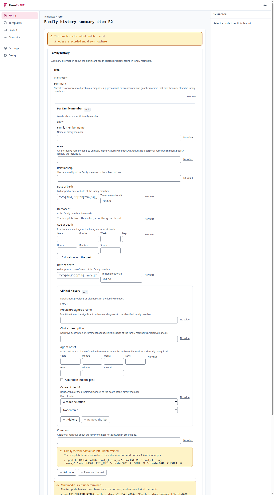

# FerroCHART

FerroCHART is a pure-Rust openEHR form builder and renderer. It compiles an
operational template into a form definition, renders that form for a
clinician, and turns the entered values back into a COMPOSITION committed to
an openEHR Clinical Data Repository over the ITS-REST API. It reads
compositions back into the same form, so one definition serves data entry,
review, and editing.

It runs as its own server beside any openEHR CDR, and uses any FHIR
terminology server to expand the value sets behind coded fields.

## What a template becomes

The compiler works. It reads both ADL generations, and 121 of the 123
committed CKM templates derive a form definition, 2621 fields across 1775
groups. The server publishes that definition and a browser draws it, with a
control for every field kind the derivation produces, each admitting what its
template admits and refusing the rest.

That picture was taken by the end-to-end battery rather than by hand, and
[the renderer](operate/renderer.md) has the rest of the screens.

The other half of the product is the layout overlay, which carries everything
no specification governs: the order the questions come in, the names and help
text a person writes over the archetype's, the values a form starts with, and
the rules that decide when a question appears. The engine is built, including
the replay across a template revision and the report of what matched, moved or
disappeared, and the browser reads one, so a form grows as it is answered
rather than asking everything at once. What is missing is the screen a person
authors one on: today a layout is written by hand.

The round trip against a real CDR runs on every pull request
([issue #126][live] is closed): the lane starts FerroEHR from the release's
own `compose.yaml`, commits a COMPOSITION FerroCHART built and validated,
reads it back and compares. What each release adds is the
[build order](evaluate/build-order.md).

The design of record is [`docs/architecture.md`][arch] in the repository,
where every decision carries a citation to a primary source or an explicit
note that no specification governs it.

## Why it exists

openEHR separates the clinical model from the software, which is what makes
the data outlive the vendor. The cost is that a template is not a screen.
Something has to turn an operational template into a form a nurse can fill in
during a ward round, and turn what they typed back into a valid COMPOSITION.

The tooling that does this well is commercial. The open source options are
thin enough that people running openEHR in a hospital build their own, one
form at a time, or go without. That gap is the reason for this project, and it
was named by the openEHR community rather than invented here.

[arch]: https://github.com/rubentalstra/FerroCHART/blob/main/docs/architecture.md
[live]: https://github.com/rubentalstra/FerroCHART/issues/126
