# The renderer

<!-- toc -->

No specification governs any screen here: it is FerroCHART's own design. What a
field collects and what it admits come from the operational template, and the
openEHR Reference Model decides what a value is. Everything about how a screen
looks is ours.

The renderer is a WebAssembly bundle that reads the form definition the server
publishes. It links no engine crate, so the screens below are what any client
of that published format can draw.

## Every picture here was taken by a test

The screenshots on this page are taken by the end-to-end battery. Nobody takes
them by hand. `scripts/ui-e2e.sh --docs-shots` starts the server over two
committed openEHR CKM templates, serves the renderer against it, drives a
pinned headless Chromium through every screen, and writes one image per screen
per theme into `website/book/src/operate/img/renderer`.

The journeys and the capture share one definition of what each screen has to
have drawn before it counts as drawn, so an image is never a picture of a page
that had not answered yet, and a screen the battery stopped covering cannot
keep a photograph here. A run without `--docs-shots` writes no image at all,
which is what makes the battery safe to run on every pull request.

Nothing is typed into a form during the capture. The two templates are
committed CKM exports with no patient content
(`corpus/templates/ckm/PROVENANCE.md`), and no image carries a name, an
identifier, or anything a clinician entered.

Every screen is shown twice, on the light ground and on the dark one. The
theme is the reader's choice, held in their browser, and both grounds are the
same semantic token names redefined, so no screen knows a colour and nothing
is styled twice.

## The template library

Every operational template the server compiled at startup, each one a link to
the form it compiles to. A template that will not compile stops the server
naming the file, so a template listed here is a template that became a form.

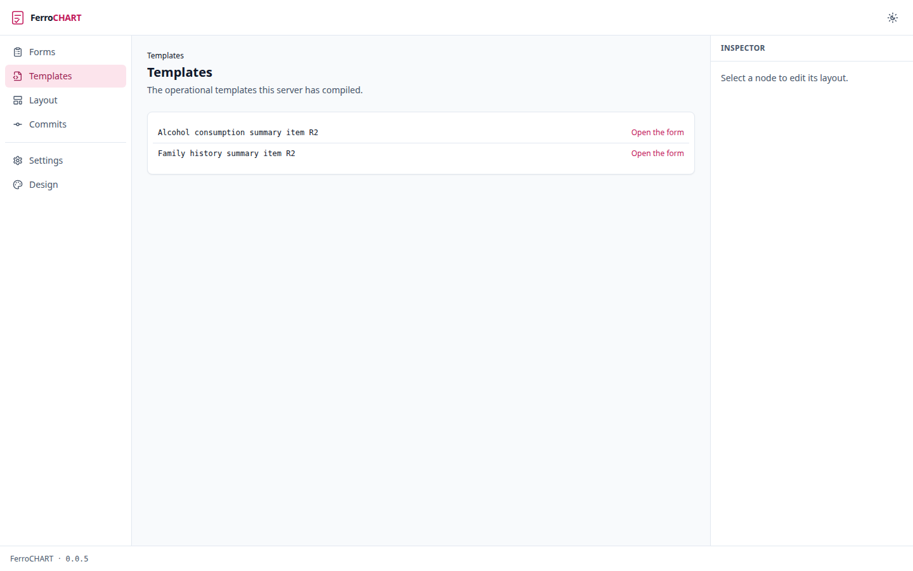

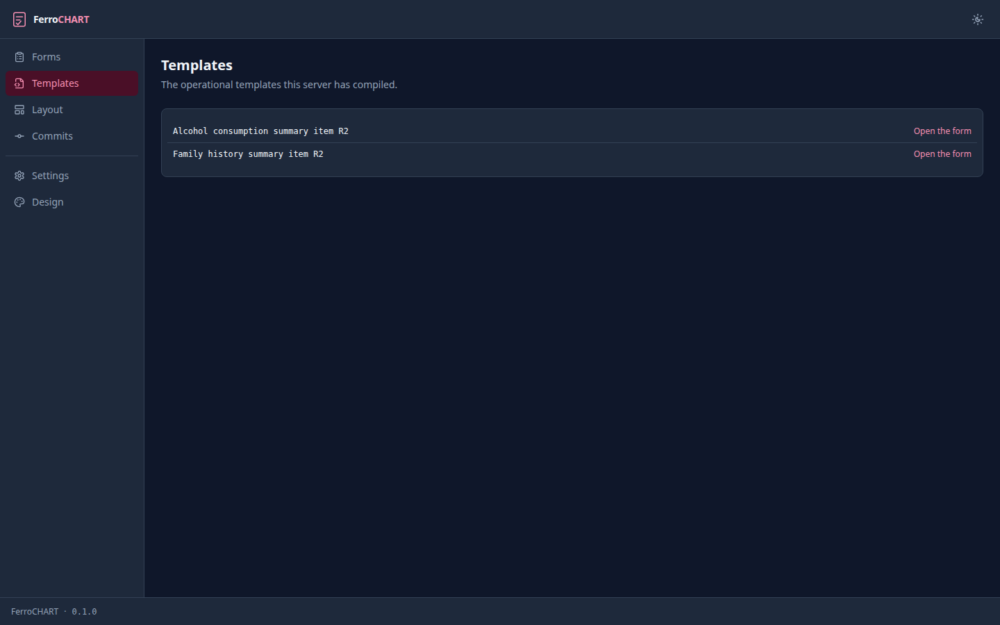

## A form

The screen a clinician works on. Field order is template order and grouping is
the Reference Model tree, so this screen decides no layout of its own.


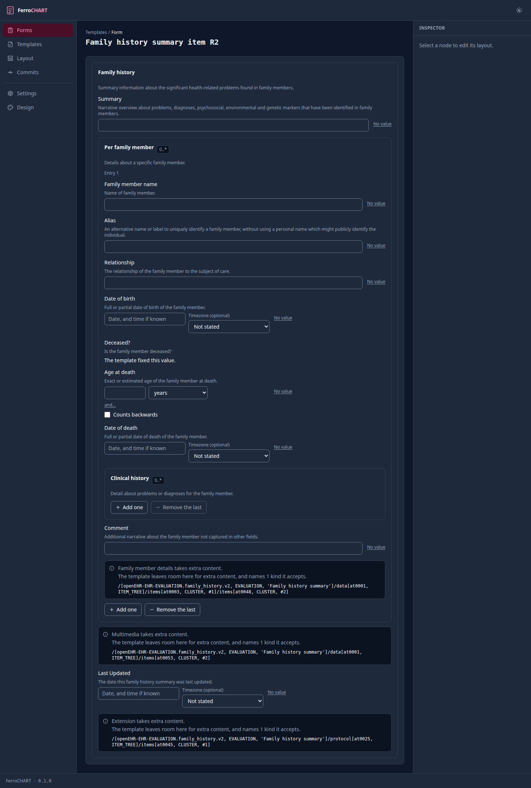

A section the template says may be absent opens with none of it: its heading,
its description, and the way to add one. openEHR AM Release-2.3.0
`AOM1.4.html` section 4.3.6 makes `occurrences` the count a node may appear
in, so a lower bound of zero is the template saying none of that section is a
complete answer. The battery opens one before it takes the picture, which is
why the form below is longer than the one a reader first meets.

Each group is a card headed by the label the template gave it. A group whose
occurrences allow more than one carries its bound as a badge and an add and
remove pair, and it opens showing the occurrences the template requires. Each
field draws the control its Reference Model type and its constraint call for:
a quantity gets a magnitude and the units the template permits, a coded text
gets a selection over its value set, a date gets the precision the template
allows. A mandatory field is marked. Content the template left undetermined is
drawn as a visible hole at the top of the form rather than dropped.

A field carries a value or a reason there is none, and never both: openEHR RM
Release-1.1.0 `data_structures.html` section 5.2.3 gives `ELEMENT` no state
that holds the two together. So a field draws its value control and a quiet
"No value" beside it, and choosing a reason replaces the control rather than
sitting under it. Answering "unknown" is rare and entering a value is the
reason the form is open, so only one of them takes the width.

Two strings in that picture read oddly, and both are the template's own. The
archetype's structure node carries the text "Tree" and the description
"@ internal @", and the compiler passes each through as the group's label and
its help, because nothing here may invent a label the template did not state.
Giving that node a name a clinician recognizes is exactly the work the layout
overlay exists for.

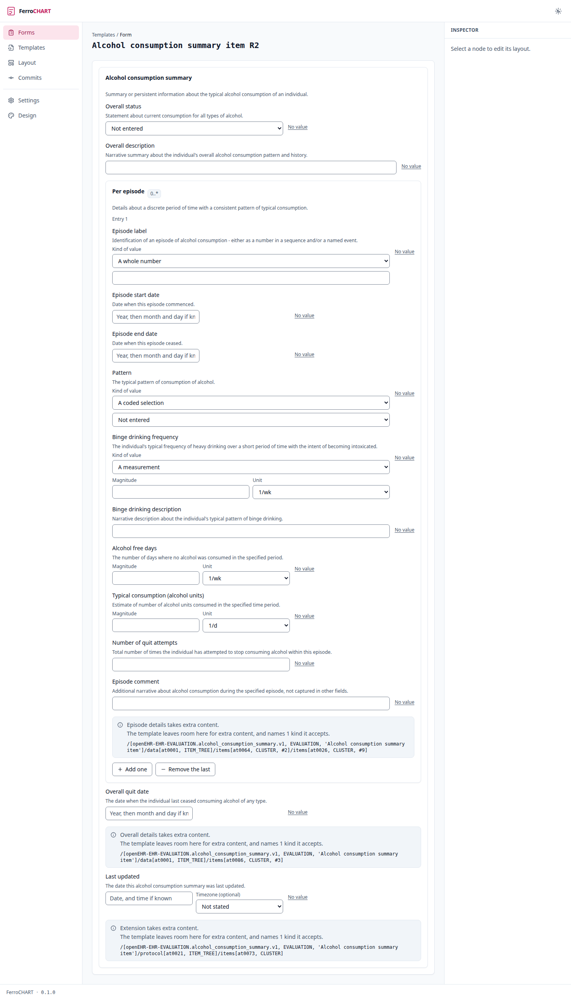

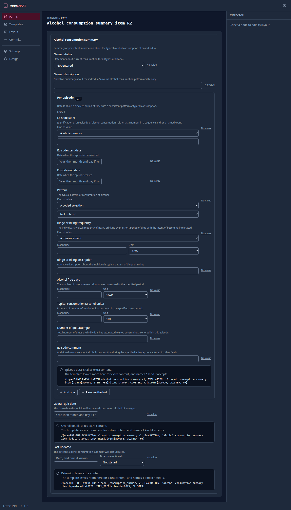

## The design system

One screen drawing every affordance the kit defines, once. A second button
style would have to appear here beside the first, which is what keeps the
screens above consistent by construction rather than by review.

It is a build-time surface and a release does not carry it. Drawing every
affordance means instantiating every control a second time, which cost 51506
gzipped bytes, 12.5% of what a clinician downloads. It is behind the `design`
cargo feature, which is on by default: `trunk serve` brings it up at
`/ui/design` and the browser battery photographs it, while the release bundle
is built `--no-default-features` and answers that address the way it answers
any address it does not serve.

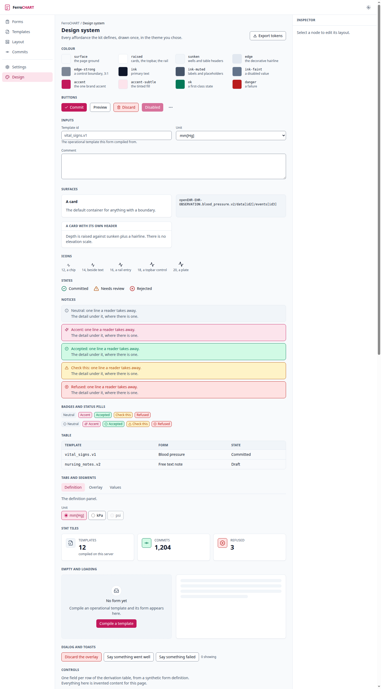

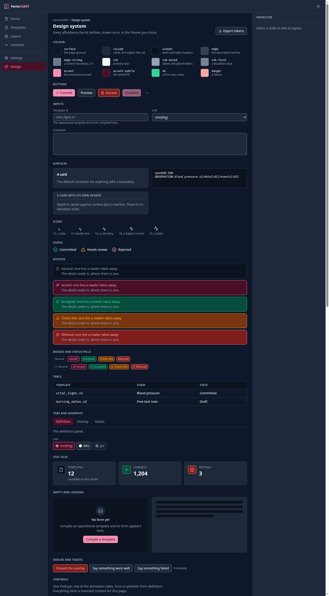

## The screens with their frame and not yet their content

Three entries on the rail lead to a heading and a line saying what the screen
will do. They are photographed with the rest, because a frame nobody has seen
is a frame nobody notices has gone wrong.

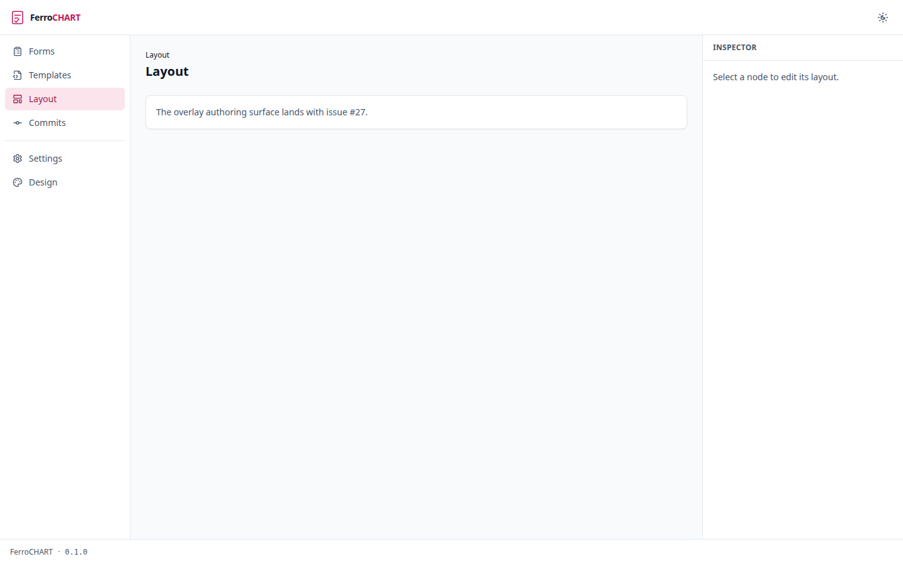

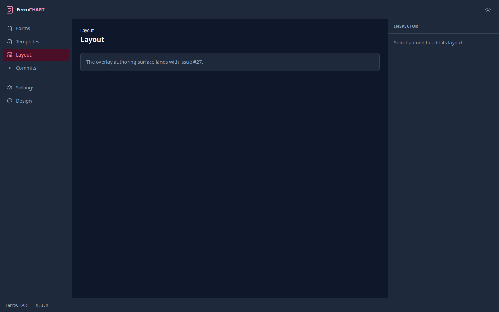

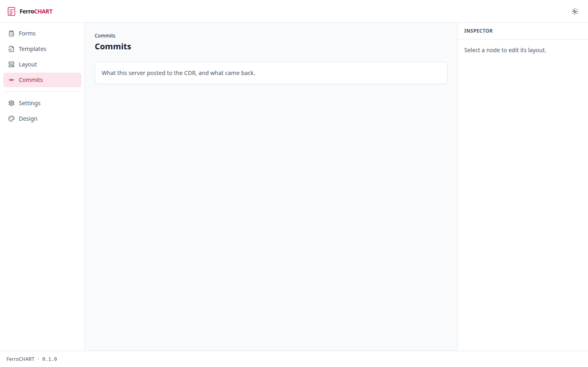

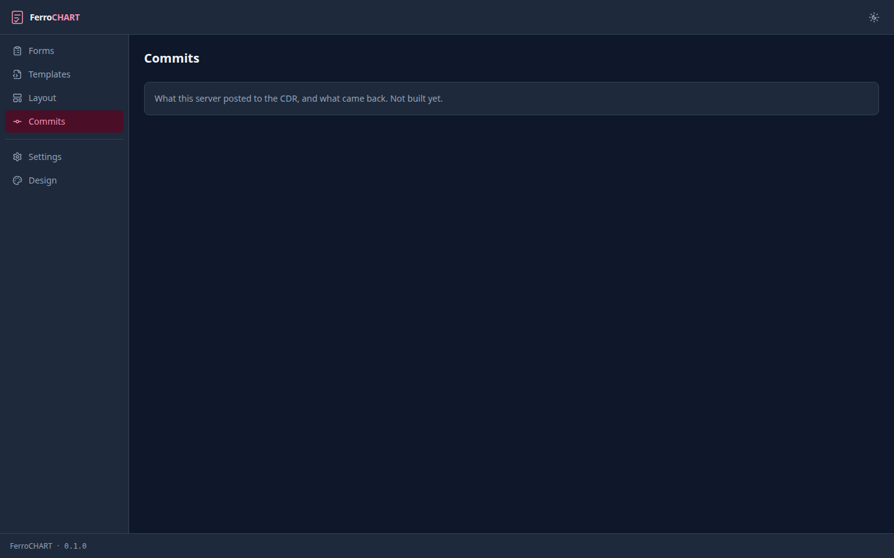

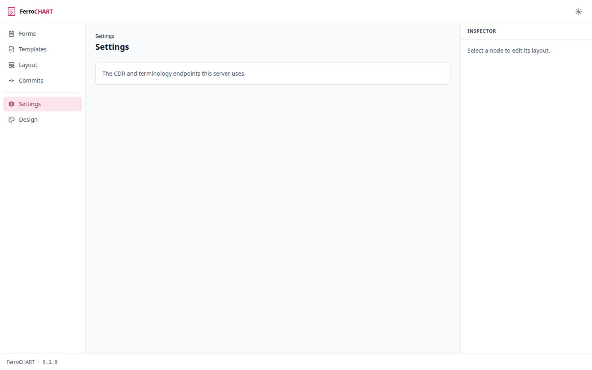

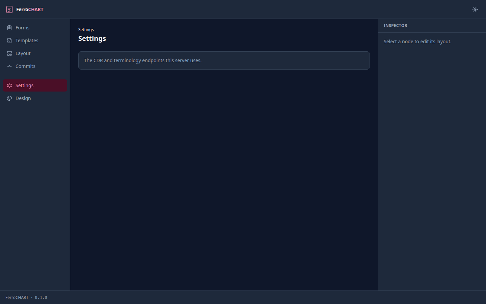

## Where a reader lands with nothing chosen

Clicking Forms on the rail with no template named reaches the form screen with
nothing to draw, so it points at the library instead.

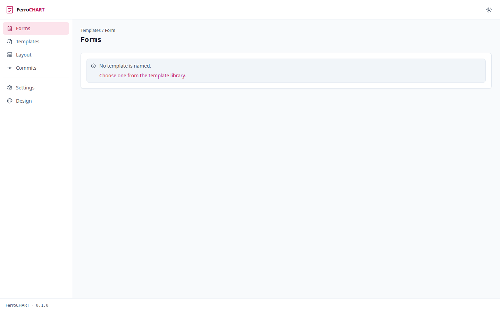

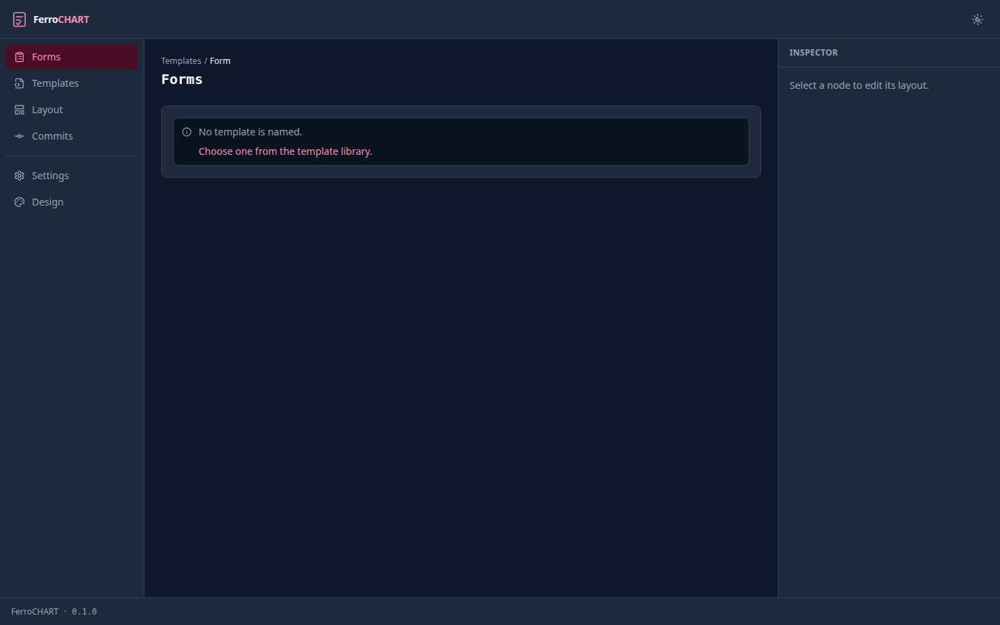

An address no route owns says so and offers the way back. It keeps the frame:
a reader who mistypes an address still has the rail, the theme control and
every way out of it.

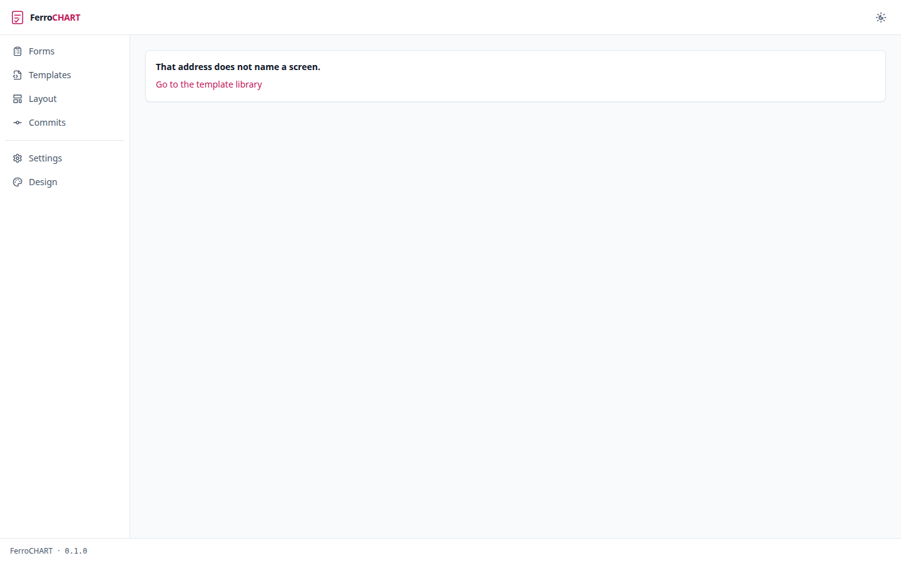

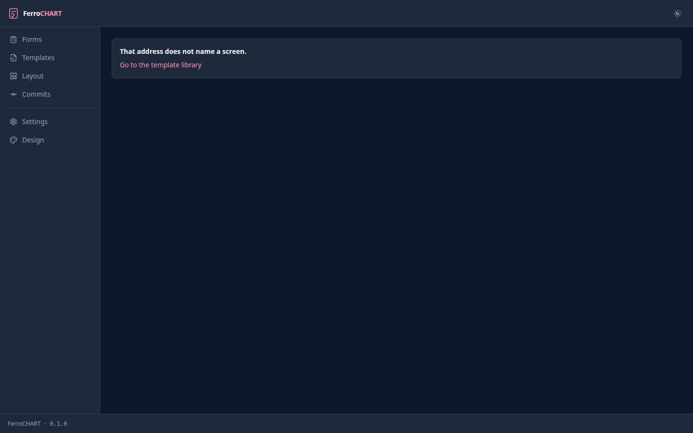

## What is not built

**No published artefact serves these screens yet.** The container image a
release publishes carries the server binary, and the server answers `/api` and
`/health` and nothing under `/ui`, so `compose.yaml` brings up the form surface
without the renderer in front of it. Building the bundle and serving it is
[issue #166][ship]. Until it lands, the battery above is how the screens run.

The rail also carries entries whose screens have their frame and not yet their
content. The layout overlay's authoring surface is [issue #27][overlay]; a
commit log of what this server posted to the CDR and a settings screen for the
endpoints it uses are both still frames. A form is drawn in template order
until the authoring surface lands.

## Running the battery yourself

```console
$ scripts/ui-e2e.sh
```

It needs `cargo`, `cargo-nextest`, `trunk`, `curl`, and a running Docker, and
it owns everything it drives: it stages the templates, starts the server,
serves the bundle, and runs the browser in a container. A journey that fails
writes a screenshot and the whole document into `target/ui-e2e-failures`, and
the CI job uploads that directory when a run fails.

To drive a deployment you already have, name both ends:

```console
$ scripts/ui-e2e.sh --base-url http://ferrochart:8180 --webdriver http://127.0.0.1:4444
```

Both are required together. A browser inside a container reaches a server on
the host through the host gateway rather than on `127.0.0.1`, and a browser
that cannot reach the address is a red lane with no defect behind it.

[overlay]: https://github.com/rubentalstra/FerroCHART/issues/27
[ship]: https://github.com/rubentalstra/FerroCHART/issues/166
